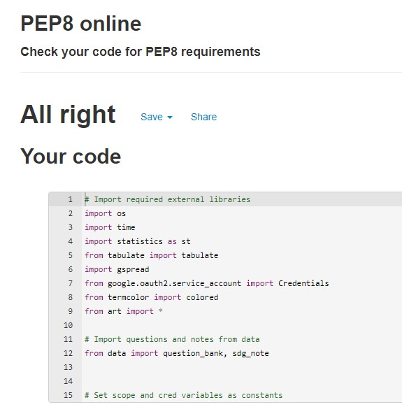

# SDG Quiz
SDG stands for Sustainable Development Goals. SDG Quiz is a command-line python application that helps users to take a quiz about the basics of the UN SDGs. The UN Agenda 2030 is a comprehensive plan that aims to ensure global sustainable development by 2030.  

By taking the SDG Quiz, individuals can have an idea of *how much they know* the SDGs. This can help them be more mindful in their behaviors and more sustainable in their life styles. Researchers may also want to give their subjects the SDG Quiz, along with other survey questions, to collect data about level of awareness of individuals. 

[SDG Quiz on Heroku](https://sdg-quizapp.herokuapp.com/)
# 

# 

# Goals
## User goals
- The goal of users of this application is to take a quiz on the UN's Sustainable Development Goals *to know how much they know*, both in absolute terms (i.e., one's own performance) and relative terms (i.e., relative to others' performance). 
## Owner goals
- The key goal of the owner of the application is to engage users in the Agenda 2030 both through compelling questions and feedback but also through an invitation to read and understand the SDGs. With socially-aware users in mind, the owner aims to motivate them by providing quiz statistics which put the user's performance in context.

# User stories

- As a user, I want to take a quiz about SDGs to assess my knowledge and understanding of the SDGs so that I can be more mindful about sustainability.
- As a user, I want to see how others are doing in the quiz so that I can compare my performance to others.
- As a user, I want to read basic facts about the SDGs so that I can refresh my memory.
- As a user, I want to be able to get feedback at each stage of the quiz so that I can understand if my actions are properly handled by the application.
- As a user, I want to know how many questions there are and how many I have left so that I can expect when the quiz ends.
- As a user, I want to see my results both for each question and overall so that I learn from questions I fail to answer too.
- As a user, I want to be able to choose what to do and be given appropriate feedback when I make mistakes so that I get the best out of the quiz.

# Key features
This quiz application has several features implemented in service of the user stories as well as the broad user and owner goals. These features include the following.

## 1. Main menu

When a user openes the application, they are greeted with a *welcome-to-the-SDG-Quiz* message. The art and green color they see first are intended to make them more interested in taking the quiz. But the choice should be the user's, and the main menu of the application appears on the same screen. There is a two-seconds delay between the welcome message and the menu to give the user a sense of lively interaction. 

The user is prompted to make a choice and hit enter. The information provided here is kept to the minimum required to avoid congested screen and confusing intructions. The program accepts the user input, checkes if it is valid and proceeds to the part of the application that matches the user's choice.  

## 2. Taking the quiz
If the user types 1 and hits enter, the input will pass the validation check and the user sees general instructions about the quiz. 

The instructions are as short and clear as possible. As some users may want to read the instructions slowly while others may want to go fast, the program does not proceed automatically. User press P at their own time to proceed. Once the input is validated, the program proceeds, and an instance of the User class is created where the user's name is required to initialize it. From this point on, the user's name and the answers they give to each question in subsequent steps will be kept track of.

The name that the user enters is checked it has at least two but not more than 20 characters. The choice of these number is arbitrary. But the implementation of such validation checks is a good way to learn and make it a habit. 

The process of showing a question, receiving input (answer for each question), displaying feedback and iterating through all 10 questions is depicted in the above flow chart. The following sample question with the correct answer illustrates some of the features in each step of the iteration.

Some points to note are:
- As this is the first question, the program wishes the user best of lucks. This is shown only at the beginning and not in subsequent questions.
- Both lower case (shown in this sample) and upper case inputs are valid.
- The feedback in case of correct answer is "Correct! Well done, *username*!" where *username* is a placeholder. The green color indicates success in contrast to feedback in case of incorrect answer which is shown in red (see below).

From the illustration of incorrect answer, an additional feature to note is the information as to what the correct answer actually is. This is a good way to learn because the user can associate what they got wrong and the correct answer they see.

I have described the steps during the iteration through all 10 questions. When there is no more question to ask, the user sees end quiz screen (indicated as *End quiz* in both the above and the below flow charts.) As indicated in the following chart, the user is told that the quiz is over. The program updates the google sheets (one where the name and score are recorded and onther sheet where name and answer for each question are recorded. More on the latter later.)

At this point, the user knows the quiz is over and waits for the program to calculate scores. The program records the new entry, sorts the data by score (so that it is stored sorted and easy to fetch top scores as in the next section.) 

The user sees both their score and three descriptive statistics about the quiz: the average, meadian and maximum scores. Then the user can choose to either start again or exit the application.
## 3. Viewing top scores
The rationale for the second choice in the main menu is that a user may want to first see the highest scores before starting the quiz. Internally, the data model used to get the user's choice, fetch sorted data from google sheets and display the names and scores of the top five users is illustrated in the following flow chart.

The data model includes a general respresentation of the features mention in the foregoing sections as well. The following illustrates what the user sees.

As the user may want to either proceed to the quiz or quit, these options are presented to the user in a brief and clear way. 
## 4. Brief note about SDGs
One of the user stories is that users want to read about SDGs to refresh their memories. To encourage to take the quiz people who feel that they do not know or remember enough, there is an option to open a screen with a small note about SDGs and a list of the 17 goals. Whether a user takes the quiz or not, creating awareness and spreading information about sustainability in general and the goals in particular is a grand aim. As such, having this feature is noble idea in and of itself. In the context of the quiz app, however, [the prompt at the end of the note](./assets/images/sdg_note.jpg) to invite the use to take the quiz circles back nicely to the core rationale for the existence of this application, i.e., to engage the user regarding the SDGs as much as possible.
## 5. Quit the app
As a part of the main menu, the user has an option to exit the application. Once the user provides a valid input nad if the choice they make is to quit and exit the application, the program thanks the user for stopping by and says 'Goodbye!'

### Features not implemented
I have mentioned earlier that the program records the answers a user gives to each question. There are several potential use cases where additional features can be added to make use of this data. 

.

One that is particularly compelling in the context of SDGs is for research that tries to link the patterns in the answers that users provide and other characteristics that can be collected by including survey questions. However, this is beyond the scope of this project, and hence not implemented.

# Testing
I have described the process of design and implementation. Now it is time to test final application against the user stories, learning outcomes and other performance indicators.
## Testing user stories
- **User story:** take a quiz about SDGs to assess one's knowledge and understanding of the SDGs
  - *Features:* One can choose 1 in the main menu, follow the instructions and take a quiz that has 10 multiple choice questions about the SDGs. 
- **User story:** see how others are doing in the quiz 
  - *Features:* One can choose 2 in the main menu and see the top five scores in the quiz.
- **User story:** read basic facts about the SDGs
  - *Features:* One can choose 3 in the main menu and read a brief note about the SDGs. The user finds all 17 goals listed in the same screen. 
- **User story:** get feedback at each stage of the quiz
  - *Features:* In all interactions between the user and the program where the user provides input, validation checks are followed by helpful feedback or error messages depending on the particular circumstance.  
- **User story:** know how many questions there are and how many I have left
  - *Features:* The instructions screen informs the user that there are 10 questions and each question is displayed with a question number in front of it. So the user knows at each step which question out of 10 questions they are answering.  
- **User story:** see results both for each question and overall
  - *Features:* Each valid answer that the user provides is evaluated and the user is told whether the answer was correct or not. At the end of the quiz, the user gets a report specifying how many correct answers they got out of 10. In fact, the user also gets a summary statistics of the quiz scores in case they want to compare their performance with those of other participants.  
- **User story:** be able to choose what to do and be given appropriate feedback
  - *Features:* The user is given different choices at different stages of the quiz. For example, the user is asked to press P to play or Q to quit once they read the notes or see the scores. This user story is one of the reasons for the option to exit the quiz from the main menu. The user can also choose when to proceed after reading the general instructions.  
## Testing Learning outcomes
Some of the learning outcomes in this project are generic in the sense that there is no specific feature or set of features that indicate that they are met. The performance of the application as well as the entire development process 
- **LO1: Implement algorithm**
  - I have tested the python code manually for PEP8 compliance and there are no issues.

    

  - The functionalities for the project work as intended. 
  - The program follows conventions and standards to make sure that the code is readable. Apropriate and helpful comments, indentations, and meaningful and self-explanatory names of classes, functions and variables have been used. 
- **LO2: Solve problem**
  - The code handles empty or invalid input data. When the program prompts the user to press P or Q, for example, it only accepts P or Q (case insensitive though). User name cannot be empty, or less than 2 characters or above 20 characters and it should have only alphabets. When the user provides any input that violates these requirements, a custom message is shown to help the user provide a valid name. 
  - External libraries and modules are imported at the beginning of the program and indicated by way of comments. The data file has inline comments to show questions that were taken or adapted from other sources (given due credit below.)
  - I have used functions that perform specific tasks such as getting name, validating input, evaluating results, displaying instructions and so on.
- **LO3: Standard programming constructs**
  - This application implements different standard programming contructs. To benefit from the object-oriented approach, users and questions have classes.
  - As reflected in the [main menu](./assets/images/main_menu.jpg), the program runs different blocks of code and/or different functions and features depending on what the user chooses. When the quiz starts, the program iterates through all the questions. Each question is a dictionary with keys for the question text, choices and the correct answer. A list of question dictionaries is used to make it easy for iteration.
  - When the user is expected to provide input, different validation checks are made. If a user input for their name consists of numbers, for example, the program tells them that they should use alphabets. If the name is too short or too long, the feedback is specific enough to inform the user what exactly to pay attention to (length of the input), because simply telling them that the name is not valid would not be very helpful in how they correct it.
- **LO4: Explain** 
  - This learning outcome is about this particular document. I hope it speaks for itself.

- **LO5: Debugging**
  - I have implemented manual testing for code validation. I have tested both the main program and the data file (run and data python files) using pep8 online checker.
  - Here are the issues I found when I used the pep8 checker and later fixed them.
    - [Issues in PEP8 test for run.py file](./assets/images/pep8_check1.jpg)
    - [Issues in run.py fixed](./assets/images/pep8_check2.jpg)
    - [Issues in PEP8 test for data file](./assets/images/pep8_check_data1.jpg)
    - [Data file debugged](./assets/images/pep8_check_data2.jpg)

- **LO6: CLI using libraries**
  - I have used different python libraries and modules to implement the required functionality. To mention some, I have used statistics to generate basic descriptive statistics, art to beautify the logo and quiz over message, tabulate to print data in a table on the command line interface.

- **LO7: Data model**
  - Starting with the user stories, I have used a working data model that meets the expected results.
  - This application has the capability to access google sheets, fetch and sort data, do descriptive statistics and present the required information to the user. 

- **LO8: Version control**
  - I used GitHub to store my code as well as, or more importantly, for version control.
- **LO9: Deployment** 
  - I have deployed the SDG QuizApp on [Heroku in this link](https://sdg-quizapp.herokuapp.com/). More on the deployment procedures later.
  - I have made sure that I removed any commented out code in the deployed application.

# Technologies used 
- I used python programming language to develop this application. It is the only required technology in this project.
- I used [pep8 online checker](http://pep8online.com/) to make the code readable.
- I used [ASCII Art Library For Python](https://pypi.org/project/art/) to create ASCII art.
- Lucid chart to sketch flow charts of the data models.
- Google sheets to store data.
- Gitpod as an online IDE.
- Heroku to deploy the application and make the site available to the world.
- GitHub for storing code and for version control.

# Debugging
- I used the [pep8 online checker](http://pep8online.com/) to identify issues in the code. The question in the data file were particularly difficult as there was a trade off between indentations in the code and line wrapping in the quiz screen. I fixed this by including \ in the code so that python doesn't add unnecessary space when it prints the questions. 
- I had only limited validation check in the main menu until I used a while loop and the try, except statements which helped me separate errors related to non-numeric input and those that are out of the range of choices. 
- The average score reported at the end of the quiz would sometimes have many decimal points depending on the values used to calculate it. In the beginning I did not notice this, but in one of the tests I saw that the floating number looked too long. I fixed this by rounding the value obtained from the mean function.
-  
# Deployment
### How to deploy on heroku
  - Sign in to Heroku (Sign up if for the first time)
  - Click on **New** on the right hand side and select **Create new app**
  - Enter App name such as *sdg_quizapp* in my case, and choose region (mine is *Europe*) then click on **Create app**
  - Select the app you just created from the dashboard and go to **Settings**
  - Scroll down to **Config Vars** and click the **Reveal Config Vars** button. In the Config Vars, create CREDS key and copy the content of CREDS.json file and paste it as a value for this key. Then enter PORT as a key and give it a value of 8000.
  - Scroll down and find the **Buildpacks** section. Click on the **Add buildpack** button. Select python and node.js as buildpacks in that order.
  - Navigate to **Deploy** where you found Settings. 
  - In the **Deployment method** section, select **Github**. 
    - To configure access to GitHub, click on your profile, 
    - Go to Account settings
    - Select the Applications tab 
    - Authorize GitHub in the **Third-party Services** section.
  - Type the name of your repository (mine is *sdg.quiz*) and hit Enter. Select the one you are looking for and click Connect. 
  - You can choose to deploy manually. I have enabled automatic deploys so that the application captures the updates I push to my GitHub repository. 
  - Wait for the system to build your app. My application is [live here](https://sdg-quizapp.herokuapp.com/).
### Cloning
To clone a copy of the code in the repository to your local machine,
- Go to https://github.com and find the repository for this project (sdg-quiz) or simply [click here](https://github.com/Amareteklay/sdg-quiz).
- Click on **Code**, which is a dropdown menu with options to clone using HTTPS, SSH or GitHub CLI.
- You can choose to download zip file using HTTPS.
- Or you can copy the command to clipboard.
- Open the terminal on your machine.
- Locate the directory where you want to clone.
- Use *git clone URL*, where is what you just copied to clipboard, and hit Enter to get a local clone of the sdg-quiz application.
# Credit
## Content
- Description of SDGs was copied from [this page](https://www.undp.org/sustainable-development-goals?utm_source=EN&utm_medium=GSR&utm_content=US_UNDP_PaidSearch_Brand_English&utm_campaign=CENTRAL&c_src=CENTRAL&c_src2=GSR&gclid=Cj0KCQjw3IqSBhCoARIsAMBkTb3nuP_n4d0SmgyXs19VU0vFHfZphewUCOk3J0hHHeh8Gv17Xt6I1g4aAk-fEALw_wcB).
- The list of SDGs in the SDG note screen were copied from [this page](https://www.un.org/development/desa/disabilities/envision2030.html).
## Code
- I used the template provided by the CI to develop this application. Hosting it on a virtual CLI would have been difficult if this template were not available.

# Acknowledgements
I am always grateful to Moosa, my mentor for his helpful suggestions and encouraging words. I would like to thank the CI developers who created this well-designed and well-presented python essentials course. 

